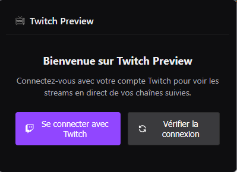
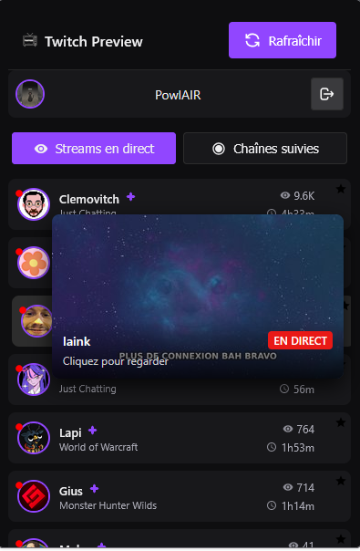
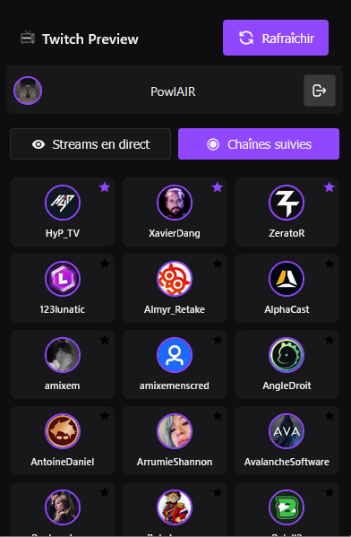

# Twitch Preview

<div align="center">

[](https://github.com/powlair/twitch-preview/releases)
[](LICENSE)
[](Version-Firefox/)
[](Version-Chrome/)
[](twitch-oauth-handler/)

**Extension de navigation Twitch avec notifications en temps réel et surveillance continue**

[Installation](#installation) •
[Fonctionnalités](#fonctionnalités) •
[Documentation](#documentation) •
[Contribution](#contribution) •
[Support](#contact)

</div>

<div align="center">
  <table>
    <tr>
      <td align="center" width="33%">
        <br/>
        <b>Page de connexion</b><br/>
        <sub>Interface de connexion avec authentification Twitch sécurisée</sub>
      </td>
      <td align="center" width="33%">
        <br/>
        <b>Streams en direct</b><br/>
        <sub>Liste des streams avec notifications en temps réel</sub>
      </td>
      <td align="center" width="33%">
        <br/>
        <b>Chaînes suivies</b><br/>
        <sub>Gestion des chaînes suivies et système de favoris</sub>
      </td>
    </tr>
  </table>
</div>

## Fonctionnalités

### Fonctionnalités principales
- **Notifications en temps réel** : Alertes instantanées pour les nouveaux streams
- **Système de favoris** : Notifications ciblées pour vos streamers préférés
- **Interface moderne** : Design Twitch avec thème sombre élégant
- **Surveillance continue** : Fonctionne 24/7, même navigateur fermé
- **Cache intelligent** : Performance optimisée avec cache persistant
- **Gestion personnalisée** : Filtrage avancé par favoris et préférences
- **Sécurité renforcée** : OAuth 2.0 avec validation CSRF
- **Multi-navigateur** : Compatible Firefox et Chrome

### Nouveautés v1.2.2
- **Service persistant** : Extension active en permanence (Manifest V3)
- **Notifications intelligentes** : Système anti-doublon avec cache 5h
- **Interface améliorée** : Nouvelle disposition avec icônes d'actions
- **Keep-alive avancé** : Triple système de maintien d'activité
- **Cache optimisé** : Données persistantes et récupération automatique
- **Logs nettoyés** : Version production sans debug
- **UX améliorée** : Interactions fluides et animations

### Système de notifications
- **Détection automatique** : Surveillance des streams toutes les 1-5 minutes
- **Filtrage intelligent** : Global ou favoris uniquement
- **Clic-action** : Ouvre directement le stream sur Twitch
- **Anti-spam** : Pas de notifications multiples pour le même stream
- **Persistance** : Fonctionne même Firefox fermé

## Installation

<details>
<summary><b>Firefox (Recommandé)</b></summary>

### Installation manuelle
1. Téléchargez le dossier `Version-Firefox/`
2. Ouvrez Firefox et allez dans `about:debugging`
3. Cliquez sur "Ce Firefox" > "Charger un module temporaire"
4. Sélectionnez le fichier `manifest.json` dans `Version-Firefox/`

### Requirements Firefox
- Firefox 109+ (Manifest V3 support)
- Service Workers activés (par défaut depuis Firefox 115)

</details>

<details>
<summary><b> Chrome</b></summary>

### Installation manuelle
1. Téléchargez le dossier `Version-Chrome/`
2. Ouvrez Chrome et allez dans `chrome://extensions/`
3. Activez le "Mode développeur"
4. Cliquez sur "Charger l'extension non empaquetée"
5. Sélectionnez le dossier `Version-Chrome/`

### Requirements Chrome
- Chrome 88+ (Manifest V3 support)
- Extensions activées

</details>

<details>
<summary><b>⚙️ Installation pour développeurs</b></summary>

### 1. Cloner le projet
```bash
git clone https://github.com/powlair/twitch-preview.git
cd twitch-preview
```

### 2. Configuration API Twitch
- Créez une application sur [Twitch Developer Console](https://dev.twitch.tv/console)
- Dans `Version-Firefox/src/background/background-firefox.js`, configurez :
  ```javascript
  const TWITCH_API = {
      CLIENT_ID: 'votre_client_id',
      CLIENT_SECRET: 'votre_client_secret',
      REDIRECT_URI: 'https://twitch-preview.vercel.app/api/auth/callback'
  };
  ```

### 3. Déployer le service OAuth
```bash
cd twitch-oauth-handler
npm install
npm run build
npm run dev  # Pour développement local
# Ou déployer sur Vercel/Netlify pour production
```

### 4. Installer l'extension
- **Firefox** : `about:debugging` > "Ce Firefox" > "Charger un module temporaire"
- **Chrome** : `chrome://extensions/` > "Mode développeur" > "Charger l'extension non empaquetée"

</details>

## Documentation

<details>
<summary><b>Architecture du projet</b></summary>

```
Twitch-Preview/
├── Version-Firefox/              # Extension Firefox (Manifest V3)
│   ├── manifest.json                # Configuration extension
│   └── src/
│       ├── assets/icons/           # Icônes extension
│       ├── auth/                   # Authentification OAuth
│       │   ├── auth.html           # Page callback
│       │   └── auth.js             # Script OAuth
│       ├── background/             # Service Worker persistant
│       │   └── background-firefox.js  # Script principal avec keep-alive
│       ├── options/                # Page des options
│       │   ├── options.html        # Interface options
│       │   ├── options.css         # Styles modernes
│       │   └── options-firefox.js  # Script options
│       ├── popup/                  # Interface principale
│       │   ├── index.html          # Structure popup
│       │   ├── style.css           # Styles popup
│       │   └── popup-firefox.js    # Script popup
│       └── utils/
│           └── env.js              # Configuration API
│
├── Version-Chrome/               # Extension Chrome (Manifest V3)
│   ├── manifest.json               # Configuration Chrome
│   └── src/                        # Structure similaire à Firefox
│
├── twitch-oauth-handler/         # Service OAuth Next.js
│   ├── pages/
│   │   ├── index.tsx               # Page d'accueil service
│   │   ├── 404.tsx                 # Page erreur 404
│   │   └── api/auth/
│   │       └── callback.ts         # Handler OAuth callback
│   ├── next.config.ts              # Configuration Next.js
│   └── package.json                # Dépendances service
│
└── docs/                        # Documentation et images
```

### **Flux d'authentification**
1. **Extension** → Ouvre popup OAuth Twitch avec state sécurisé
2. **Twitch** → Utilisateur autorise l'application
3. **Service OAuth** → Traite le callback, valide le state et extrait le token
4. **Extension** → Reçoit le token via redirection et stocke sécurisé
5. **Surveillance** → Démarre automatiquement la surveillance des streams

### **Flux de notifications**
1. **Alarme Firefox** → Déclenche vérification toutes les 1-5 minutes
2. **API Twitch** → Récupère les streams actuels des chaînes suivies
3. **Comparaison** → Détecte les nouveaux streams vs cache précédent
4. **Filtrage** → Vérifie préférences (global/favoris) et anti-doublon
5. **Notification** → Crée notification Firefox native avec avatar
6. **Action** → Clic ouvre le stream sur Twitch.tv

</details>

<details>
<summary><b>Configuration et options</b></summary>

### **Options disponibles**
- **Notifications** : Activer/désactiver les alertes push
- **Favoris uniquement** : Limiter les notifications aux streamers favoris
- **Statistiques** : Visualiser les métriques d'utilisation
- **Cache intelligent** : Validation token toutes les 5 heures
- **Keep-alive** : Maintien d'activité automatique

### **Permissions requises (Manifest V3)**
- `storage` : Stockage sécurisé des préférences et tokens
- `notifications` : Affichage des alertes de nouveaux streams
- `alarms` : Surveillance continue et keep-alive
- `action` : Badge et popup de l'extension
- `host_permissions` : Accès aux APIs Twitch et service OAuth

### **🌐 URLs autorisées**
- `https://api.twitch.tv/*` : API Helix Twitch
- `https://id.twitch.tv/*` : Service d'authentification Twitch
- `https://twitch-preview.vercel.app/*` : Service OAuth handler
- `https://embed.twitch.tv/*` : Intégration player Twitch
- `https://player.twitch.tv/*` : Player Twitch

</details>

<details>
<summary><b>🔧 Fonctionnement technique</b></summary>

### **Système Keep-Alive (Manifest V3)**
```javascript
// Triple système pour maintenir l'activité
1. Alarmes courtes (30 secondes)
2. Port de communication maintenu
3. Timer classique en backup
```

### **Cache intelligent**
```javascript
// Validation token : 5 heures
// Données utilisateur : 5 minutes  
// Streams : 2 minutes
// Anti-doublon notifications : 6 heures
```

### **Logique de notifications**
```javascript
// Conditions pour notifier :
1. Notifications activées
2. Stream pas déjà notifié (clé: user_id_started_at)
3. Si mode favoris : streamer dans la liste favoris
4. Stream détecté comme nouveau (pas dans cache précédent)
```

</details>

## Sécurité

### **Mesures de sécurité**
- **OAuth 2.0** : Authentification sécurisée via Twitch
- **State validation** : Protection CSRF avec validation du state
- **Token chiffré** : Stockage sécurisé dans browser.storage.local
- **CSP stricte** : Content Security Policy renforcée Manifest V3
- **HTTPS only** : Toutes les communications chiffrées
- **Headers sécurisés** : X-Frame-Options, X-Content-Type-Options
- **Aucune collecte** : Aucune donnée personnelle collectée ou transmise
- **Cache local** : Données stockées uniquement localement

## Contribution

Les contributions sont les bienvenues ! Pour contribuer :

### **Processus de contribution**
1. **Fork** le projet
2. **Créez une branche** (`git checkout -b feature/AmazingFeature`)
3. **Committez** vos changements (`git commit -m 'Add: Amazing Feature'`)
4. **Push** vers la branche (`git push origin feature/AmazingFeature`)
5. **Ouvrez une Pull Request**

### **Guidelines de développement**
- Respectez le style de code existant
- Testez sur Firefox ET Chrome
- Documentez les nouvelles fonctionnalités
- Vérifiez la compatibilité Manifest V3
- Maintenez la sécurité et la performance
- Nettoyez les logs de debug

### **Rapporter un bug**
- Utilisez les [GitHub Issues](https://github.com/powlair/twitch-preview/issues)
- Précisez le navigateur et la version
- Incluez les étapes de reproduction
- Ajoutez les logs d'erreur si disponibles

## Statistiques du projet

- **Version actuelle** : 1.2.2
- **Compatible** : Firefox 109+ • Chrome 88+
- **Manifest** : V3 (service workers)
- **OAuth** : Service dédié sécurisé
- **Notifications** : Temps réel 24/7
- **Cache** : Intelligent et persistant
- **Performance** : Optimisée avec keep-alive
- **Langue** : Français

## Licence

Distribué sous la **MIT License**. Voir [`LICENSE`](LICENSE) pour plus d'informations.

## Roadmap

### **🔮 Fonctionnalités prévues**
- [ ] Support Safari (Manifest V3)
- [ ] Mode hors ligne avec cache étendu
- [ ] Intégration chat Twitch
- [ ] Thèmes personnalisables
- [ ] Export/import des paramètres
- [ ] Analytics d'utilisation (local)

---

<div align="center">
  <sub>🎮 Fait avec passion par <strong>PowlAIR</strong></br>
   • Pour la communauté Twitch française</sub>
</div>
